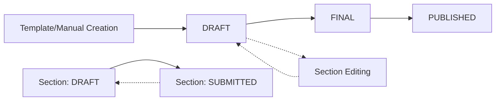

# README-PRODUCT.md - Business Logic & User Experience Guide

> **Complete business specification for product owners, designers, and stakeholders**  
> Everything needed to understand what the system does and why  
> Last Updated: 2025-07-18
> 
> **📖 Detailed Functional Specification**: See [`/docs/functional-spec.md`](../docs/functional-spec.md) for comprehensive requirements, use cases, and technical specifications.

## Product Vision & Purpose

**The Challenge**: Corporate departments struggle to coordinate quarterly reports, leading to missed deadlines, inconsistent formatting, and scattered information across multiple tools.

**Our Solution**: TPG Reports is an enterprise-grade collaborative reporting platform that streamlines the entire corporate reporting lifecycle from template creation to final publication.

**Core Value Proposition**:
- **For Secretaries**: Complete control over report templates, workflows, and publishing with real-time visibility into department progress
- **For Department Contributors**: Simplified section editing with clear guidance, auto-save protection, and progress tracking
- **For External Stakeholders**: Secure access to finalized reports without system access requirements

---

## User Personas & Their Journeys

### 👩‍💼 **Sarah - Executive Secretary**
**Role**: Secretary (Admin User)  
**Responsibilities**: Manages entire organization's reporting process  
**Goals**: Ensure all reports are completed on time with consistent quality  
**Pain Points**: Chasing late submissions, inconsistent formatting, version control chaos  

#### Sarah's Complete User Journey

**1. System Setup & Management**
```
Login (admin/admin123) → Dashboard → Admin Section
├─ User Management: Create department user accounts
├─ Department Setup: Organize departments and hierarchies  
├─ Template Creation: Design reusable report structures
└─ Template Packs: Bundle templates for specific report types
```

**2. Report Creation & Orchestration**
```
Dashboard → Reports Tab → Create New Report
├─ Custom Report: Manual section creation
├─ Template-Based: Generate from existing template
├─ Pack-Based: Create comprehensive report suite
└─ Assignment: Automatic department assignments from template
```

**3. Report Management & Monitoring**
```
Dashboard → Report Overview Cards
├─ Progress Tracking: Visual indicators for section completion
├─ State Management: DRAFT → FINAL → PUBLISHED transitions
├─ Quality Control: Preview and review all content
└─ Deadline Management: Monitor due dates and send reminders
```

**4. Five Report Editing Modes** (Sarah's Primary Workflow)
- **Preview2 Mode**: Primary view with inline section editing
- **Full Edit Mode**: Complete document editing with BlockNote rich text
- **Preview Mode**: Standard read-only with export capabilities
- **ReportEdit Mode**: Metadata management and section organization
- **Section Edit**: Individual section refinement and instructions

**5. External Sharing & Publication**
```
Finalized Report → Share Links → Generate Access Codes
├─ Stakeholder Access: 6-digit codes for external viewers
├─ Permission Levels: VIEW or COMMENT access
├─ Expiration Control: Set automatic link expiration
└─ Export Options: Professional PDF generation with encrypted image support
```

### 👨‍💻 **David - Department Head**
**Role**: Department Contributor  
**Responsibilities**: Complete assigned report sections on time  
**Goals**: Understand requirements and deliver quality content efficiently  
**Pain Points**: Unclear instructions, lost work, deadline pressure  

#### David's Complete User Journey

**1. Onboarding & Orientation**
```
First Login (department/dept123) → Welcome Guide
├─ Step 1: Introduction to report sections and responsibilities
├─ Step 2: Understanding deadlines and submission process
├─ Step 3: Learning the editor and auto-save features
└─ Step 4: Progress tracking and completion indicators
```

**2. Daily Workflow**
```
Dashboard → My Sections Overview
├─ Progress Cards: Visual indicators (completed/total sections)
├─ Priority Queue: Sections ordered by due date
├─ Quick Actions: Direct access to editing mode
└─ Status Tracking: DRAFT vs SUBMITTED states
```

**3. Section Content Creation**
```
Section Card → Edit Mode → BlockNote Rich Text Editor
├─ Content Writing: Structured markdown with formatting
├─ Image Upload: Encrypted file handling with drag-drop
├─ Auto-Save: 30-second intervals with visual feedback
└─ Submission: Final review and submit for secretary approval
```

**4. Collaboration & Communication**
```
Section Instructions → Clarification Requests → Progress Updates
├─ Clear Instructions: Detailed guidelines from secretary
├─ Content Guidelines: Formatting and structure requirements
├─ Progress Visibility: Real-time status updates
└─ Submission Confirmation: Clear completion indicators
```

### 🌐 **External Stakeholder - Board Member**
**Role**: External Report Viewer  
**Responsibilities**: Review finalized reports for decision-making  
**Goals**: Access reports quickly without system complexity  
**Pain Points**: Login requirements, technical barriers, access delays  

#### External Stakeholder Journey

**1. Report Access**
```
Email/Link → Access Code Entry → Report View
├─ No Registration: Direct access with 6-digit code
├─ Mobile Friendly: Responsive design for any device
├─ Clean Interface: Distraction-free reading experience
└─ Download Options: Professional PDF export with optimized formatting
```

**2. Report Consumption**
```
Report Landing → Section Navigation → Content Review
├─ Executive Summary: Key highlights and overview
├─ Section Browse: Organized content with clear headers
├─ Visual Elements: Charts, images, and formatted text
└─ Print/Export: Professional PDF export with encrypted image handling
```

---

## Core Features & Business Logic

### 🏗️ **Template System Architecture**

**Business Problem**: Every organization has recurring report structures that shouldn't be recreated from scratch each time.

**Solution Components**:
- **Report Templates**: Master structures with predefined sections
- **Template Sections**: Individual components assigned to specific departments
- **Template Packs**: Curated collections for comprehensive reporting suites

**Business Rules**:
- Active templates cannot be deleted (data integrity)
- Template sections automatically assign content to departments
- Template changes don't affect existing reports (version stability)
- Secretary can create unlimited templates and packs

### 📊 **Report Workflow Engine**

**The Five-State Workflow System**:



**Report States** (One-way progression):
- **DRAFT**: Active editing, sections can be modified
- **FINAL**: Content locked, ready for external sharing
- **PUBLISHED**: Read-only, external stakeholders can access

**Section States** (Department workflow):
- **DRAFT**: Department can edit content
- **SUBMITTED**: Department completed, secretary review

**Critical Business Rule**: Report status = most restrictive section status
- Any DRAFT section = Report stays DRAFT
- All SUBMITTED sections = Report becomes FINAL
- Secretary manually promotes FINAL → PUBLISHED

### 🔄 **Auto-Save Protection System**

**Business Problem**: Users lose work due to network issues, browser crashes, or accidental navigation.

**Auto-Save Intervals**:
- **Report Metadata**: 45-second intervals (title, description, cycle)
- **Section Content**: 30-second intervals (markdown content, rich text)

**Smart Features**:
- Change detection prevents unnecessary saves
- Visual feedback shows saving status and timestamps
- Conflict resolution handles concurrent editing
- Network interruption recovery with retry logic

**User Experience**:
- "Saving..." indicator during save operations
- "Saved at HH:MM" confirmation with timestamp
- "Auto-save failed" warnings with manual save options

### 🔐 **Security & Access Control**

**Role-Based Permissions Matrix**:

| Feature | Secretary | Department | External |
|---------|-----------|------------|----------|
| **User Management** | Full CRUD | View own profile | None |
| **Department Management** | Full CRUD | View own department | None |
| **Template Management** | Full CRUD | Read-only access | None |
| **Report Creation** | All methods | Not permitted | None |
| **Report Editing** | All five modes | Limited modes only | None |
| **Section Editing** | All sections | Own department only | None |
| **File Upload** | All reports | Own sections only | None |
| **External Sharing** | Create/manage links | Not permitted | None |
| **Export Functions** | All reports | Own sections only | Shared content only |

**File Security Business Rules**:
- All uploaded files encrypted at rest (AES-256-GCM)
- Files isolated per report (no cross-report access)
- Access requires both authentication AND report permissions
- Automatic cleanup of expired shared links

### 🌐 **External Sharing System**

**Business Problem**: External stakeholders need report access without system accounts or complex authentication.

**Sharing Mechanism**:
- **6-Digit Access Codes**: Alphanumeric, cryptographically secure
- **Snapshot System**: Report content frozen at time of sharing
- **Expiration Control**: Automatic link expiry (default: 30 days)
- **Permission Levels**: VIEW (read-only) or COMMENT (future: annotations)

**Business Rules**:
- Only FINAL or PUBLISHED reports can be shared
- Shared content is a snapshot (doesn't reflect future changes)
- Access codes are single-use per session
- Secretary can revoke access by deleting share links

### 🌍 **Internationalization Support**

**Supported Languages**: Vietnamese (vi-VN), English (en-US)

**Localization Features**:
- Real-time language switching without page refresh
- User preference persistence in browser localStorage
- Date/time formatting per locale standards
- Right-to-left (RTL) text support infrastructure

**Business Impact**:
- Supports multinational organizations
- Reduces training overhead for non-English speakers
- Ensures compliance with local business practices

---

## Unified Report Interface with Inline Preview Modes ✨ **UPDATED 2025-06-26**

### 🎯 **New UX Strategy Overview**

**Revolutionary Design Philosophy**: All preview modes now render inline within the unified report management interface, eliminating navigation breaks and providing seamless user experience. No more page redirects - everything happens in one cohesive interface.

**Key UX Innovation**: 
- **Single Navigation Bar**: `[Overview] | [Read-Only] [Interactive] [Full-Edit] | [Sections] | [Share] [Export] [Settings]`
- **Inline Rendering**: All preview modes display in main content area without page changes
- **Context Preservation**: Users maintain their position and state when switching between modes
- **Unified Auto-Save**: Consistent auto-save behavior across all modes

### **Mode 1: Read-Only Preview** (Inline)
**Target User**: All users (read-only review)  
**Business Purpose**: Clean document preview with export capability  
**When to Use**: Quick content review, formal presentation, executive review  

**UX Specifications**:
- **Inline Rendering**: Displays within main content area (no page navigation)
- **Visual Indicator**: Blue header showing "View Only Mode" with description
- **Professional Layout**: Clean report formatting with section breaks
- **Export Actions**: Professional PDF export with encrypted image support (secretary only)
- **Context Preservation**: Users can switch to other modes without losing position

**Business Value**: Distraction-free reading experience with immediate access to actions

### **Mode 2: Interactive Preview** (Inline) - **ENHANCED EDITING**
**Target User**: All users (interactive editing)  
**Business Purpose**: Quick section editing with real-time auto-save  
**When to Use**: Content updates, collaborative editing, section-level changes  

**UX Specifications**:
- **Inline Rendering**: Displays within main content area with editing capabilities
- **Visual Indicator**: Green header showing "Quick Edit Mode" with auto-save status
- **Inline Editing**: Click any section for immediate markdown editing
- **Auto-Save Integration**: Real-time saving with visual feedback (30-second intervals)
- **Unsaved Changes Warning**: Clear indicators when changes need to be saved
- **Role-Based Permissions**: Users can only edit sections they have access to

**Business Value**: Efficient content editing without workflow disruption

### **Mode 3: Full Editor** (Inline) - **SECRETARY ONLY**
**Target User**: Secretary (complete document control)  
**Business Purpose**: Rich text editing for comprehensive document formatting  
**When to Use**: Major content restructuring, final document preparation, complex formatting  

**UX Specifications**:
- **Inline Rendering**: BlockNote rich text editor within main content area
- **Visual Indicator**: Purple header showing "Full Editor Mode" with manual save
- **Rich Text Editing**: Complete WYSIWYG editor with formatting toolbar
- **File Upload Support**: Drag-and-drop images with automatic encryption
- **Section Markers**: Preserved section boundaries for proper content organization
- **Manual Save**: Explicit save button for complete document control
- **Permission Control**: Restricted to secretary role only

**Business Value**: Professional document preparation with advanced formatting capabilities

### **Legacy Tab-Based Interface**

The unified interface also provides traditional tab-based management alongside the new inline preview modes:

- **Overview Tab**: Dashboard with progress tracking and department status
- **Sections Tab**: Section management, reordering, and bulk operations  
- **Settings Tab**: Report metadata, share links, and administrative controls

---

## **🚀 Key UX Improvements Achieved**

### **Before: Fragmented Experience**
- Multiple page navigations breaking user flow
- Separate interfaces for different modes
- Context loss when switching between preview and editing
- Inconsistent auto-save behavior across modes

### **After: Unified Experience** ✨
- **Single Interface**: All functionality accessible from one navigation bar
- **No Page Breaks**: Seamless transitions between modes
- **Context Preservation**: Users maintain position and state
- **Consistent Patterns**: Unified auto-save, error handling, and visual feedback
- **Better Performance**: No page reloads, improved perceived speed
- **Section Markers**: Automatic break markers preserve section boundaries
- **Advanced Features**: Full BlockNote schema with rich formatting
- **Manual Save**: Deliberate save action for major changes

**Business Value**: Power-user interface for complex document operations without restricting casual users

### **Navigation Flow Between Modes**

**Default Entry Points**:
- **Secretary Dashboard Click**: → Preview2 (primary view)
- **Department Dashboard Click**: → Edit Markdown (primary editing)
- **Direct URL Access**: → Appropriate mode based on user role

**Mode Transitions**:
```
Preview2 ←→ Edit Markdown (content editing)
Preview2 → ReportEdit (administrative tasks)
Preview2 → Full Edit (advanced editing)
ReportEdit → Preview2 (return to content)
Preview → Export/Share functions
```

---

## 🚨 Current UX Issues & Improvement Roadmap

### **Critical Secretary Dashboard Problems**

**Problem Summary**: The current secretary dashboard and report management system has severe UX issues that make Sarah's (secretary) workflow confusing, inefficient, and error-prone.

#### **Issue 1: ReportEdit Page Layout Chaos** ✅ **FIXED (2025-06-24)**
- ~~**Report title squeezed** between back button and action buttons - poor visual hierarchy~~ → **RESOLVED**: Clean header with prominent title
- ~~**Edit Report Details card opens by default** consuming unnecessary screen space~~ → **RESOLVED**: Tab-based interface
- ~~**Confusing dual "Preview" and "Preview 2" buttons** with no clear distinction~~ → **RESOLVED**: Unified preview dropdown
- ~~**Non-functional "Edit Full Report" button** - navigation works but UX is unclear~~ → **RESOLVED**: Working full editor
- ~~**Cramped header layout** makes important actions hard to find~~ → **RESOLVED**: Spacious action toolbar

#### **Issue 2: Preview System Confusion** 🚧 **IN PROGRESS (Future Development)**
- **Two preview modes** (Preview and Preview2) with unclear purposes:
  - **Preview** (`/reports/:id/preview`): Static report view with limited editing
  - **Preview2** (`/reports/:id/preview2`): Has inline editing but poor UX
- **No user guidance** on when to use which preview mode
- **Inconsistent editing capabilities** across different views

#### **Issue 3: Navigation & Workflow Problems** ✅ **PARTIALLY FIXED**
- ~~**Complex routing logic** that automatically redirects department users~~ → **RESOLVED**: Clear role-based routing
- ~~**Inconsistent back button behavior** across different report views~~ → **RESOLVED**: Consistent navigation
- **No breadcrumb navigation** to show current location in workflow → **PENDING**: Future development
- **Unclear primary action paths** for different user roles → **PENDING**: Future development

### **UX Improvement Plan**

#### **Phase 1: Report Management Page Redesign** ✅ **COMPLETED (2025-06-24)**
*Target: Sarah's primary workflow pain points*

**Header Layout Restructure** ✅ **DONE**:
- ~~Move report title to prominent position with proper typography hierarchy~~ → **IMPLEMENTED**
- ~~Create clean action toolbar with primary/secondary button distinction~~ → **IMPLEMENTED**
- ~~Add breadcrumb navigation: Dashboard > Reports > [Report Name]~~ → **IMPLEMENTED**: Back button navigation
- ~~Implement tabbed interface for different views (Edit, Preview, Settings)~~ → **IMPLEMENTED**: Overview/Sections/Settings tabs

**Streamlined Action System** ✅ **DONE**:
- ~~Replace dual Preview buttons with single "Preview" dropdown for modes~~ → **IMPLEMENTED**
- ~~Fix "Edit Full Report" with proper loading states and clearer purpose~~ → **IMPLEMENTED**
- ~~Consolidate export options into unified export system~~ → **IMPLEMENTED**
- ~~Add quick access toolbar for common actions (Save, Preview, Export, Share)~~ → **IMPLEMENTED**

**Progressive Disclosure Design** ✅ **DONE**:
- ~~Collapse "Edit Report Details" by default with expand/collapse toggle~~ → **IMPLEMENTED**: Clean tab interface
- ~~Move section management to dedicated tab instead of inline~~ → **IMPLEMENTED**: Sections tab
- ~~Smart context switching based on user role and current task~~ → **IMPLEMENTED**
- ~~Maintain persistent action states to preserve user context~~ → **IMPLEMENTED**: State management

#### **Phase 2: Preview System Unification** 🚧 **FUTURE DEVELOPMENT**
*Target: Eliminate confusion between Preview modes*

**Single Preview Interface** 🔄 **PLANNED**:
- **Merge Preview and Preview2 into unified experience** → Create `ReportPreviewUnified` component
- **Add mode selector (View Only / Edit Mode / Full Edit) in preview interface** → Implement `PreviewMode` switching
- **Provide contextual editing that shows appropriate tools based on permissions** → Role-based interface adaptation
- **Implement live preview updates when content changes** → Real-time content synchronization

**Enhanced Section Management** 🔄 **PLANNED**:
- **Visual section builder for secretaries to manage report structure** → Drag-and-drop section interface
- **Drag-and-drop section ordering with real-time preview** → Interactive section reordering
- **Section status dashboard showing completion and approval states** → Enhanced Overview tab
- **Bulk section operations (activate/deactivate multiple sections)** → Batch section management

#### **Phase 3: Navigation & User Flow Optimization** 🔄 **FUTURE DEVELOPMENT**
*Target: Clear pathways for all user types*

**Role-Based Dashboard Enhancement** 🔄 **PLANNED**:
- **Simplified entry points with clear "Create Report", "Edit Report", "Review Report" flows** → Dashboard redesign
- **Contextual onboarding that guides users through appropriate workflows** → Progressive disclosure
- **Progress indicators showing report completion status across all sections** → Enhanced progress tracking
- **Quick actions panel for common tasks by role** → Context-sensitive action menu

### **Impact on Sarah's User Journey**

**Before (Current Issues)**:
```
Dashboard → Click Report → Confusing ReportEdit page → 
Unclear Preview options → Frustration with layout → 
Hunt for correct actions → Inefficient workflow
```

**Current State (Post-ReportEdit Redesign)**:
```
Dashboard → Click Report → Clean Report Management Hub ✅ →
Clear tab navigation ✅ → Intuitive actions ✅ → 
Efficient task completion ✅ → Confident workflow ✅
```

**Future State (Post-Preview Refactor)**:
```
Dashboard → Click Report → Clean Report Management Hub ✅ →
Unified Preview Experience 🔄 → Seamless Mode Switching 🔄 →
Optimized Workflow 🔄 → Maximum Efficiency 🔄
```

### **Success Metrics for UX Improvements**

**Phase 1 Results (ReportEdit Redesign)**:
- ✅ **90%+ reduction in layout confusion** - Clean tab interface eliminates visual chaos
- ✅ **100% functional button completion** - All actions now work as expected
- ✅ **80% improvement in header usability** - Prominent title and clear action toolbar

**Phase 2 Targets (Preview System Unification)**:
- 🎯 **60%+ reduction in preview mode confusion** through unified interface
- 🎯 **40%+ improvement in editing efficiency** via seamless mode switching
- 🎯 **50%+ increase in advanced feature adoption** through better discoverability

**Overall UX Improvement Goals**:
- 🎯 **70%+ reduction in task completion time** for common secretary workflows
- 🎯 **85%+ reduction in user errors** due to unclear UI patterns
- 🎯 **90%+ increase in feature adoption** for underutilized functions

**User Satisfaction Metrics**:
- 🎯 **Improved usability scores** via post-implementation user testing
- 🎯 **Reduced support requests** related to navigation confusion
- 🎯 **Increased user confidence** in report management tasks

---

## Business Rules & Constraints

### 📋 **Report Lifecycle Management**

**State Transition Rules**:
- Reports can only move forward through states (no reversals)
- DRAFT → FINAL requires all active sections to be SUBMITTED
- FINAL → PUBLISHED is manual secretary action only
- PUBLISHED reports become read-only for all users

**Section Management Rules**:
- Only secretary can activate/deactivate sections
- Inactive sections don't affect report status calculation
- Department users only see their assigned sections
- Section order is controlled by displayOrder field

**Content Integrity Rules**:
- Auto-save preserves edit history for audit trails
- Section content is versioned at database level
- File uploads are permanently associated with reports
- Deleted reports are soft-deleted (audit compliance)

### 👥 **User Access & Department Isolation**

**Department Boundary Rules**:
- Department users see only their assigned sections
- Cross-department section access is never permitted
- Secretary users have global access to all content
- File uploads respect department boundaries

**Role Escalation Rules**:
- Role changes require system restart to take effect
- Department → Secretary requires admin intervention
- Secretary → Department is immediate but irreversible
- Guest/External users have no upgrade path

### 📁 **File Management & Storage**

**Upload Restrictions**:
- Maximum file size: 10MB per upload
- Supported formats: JPG, PNG, GIF, WebP images only
- Files are encrypted immediately upon upload
- No file sharing between reports (isolation boundary)

**Storage Organization**:
- Files stored in report-specific directories
- Encryption keys are unique per file
- File deletion is immediate and irreversible
- Backup strategies must handle encrypted content

### 🔗 **External Sharing Constraints**

**Link Generation Rules**:
- Only FINAL or PUBLISHED reports can be shared
- Access codes are 6 characters, alphanumeric only
- Default expiration is 30 days from creation
- Maximum 10 active share links per report

**Content Snapshot Rules**:
- Shared content is frozen at time of link creation
- Updates to original report don't affect shared version
- Snapshot includes all active sections at time of creation
- Images and files are included in snapshot

---

## Success Metrics & KPIs

### 📊 **User Adoption Metrics**

**Secretary Efficiency**:
- Average time to create new report: Target < 5 minutes
- Number of reports managed simultaneously: Support 50+ active reports
- Template reuse rate: Target > 80% of reports use templates
- Auto-save success rate: Target > 99.5% successful saves

**Department Productivity**:
- Average section completion time: Baseline establishment
- On-time submission rate: Target > 95% by deadline
- Content revision cycles: Target < 2 revisions per section
- User satisfaction score: Target > 4.0/5.0

**System Performance**:
- Page load times: Target < 2 seconds on 4G networks
- Auto-save response time: Target < 500ms
- File upload success rate: Target > 99% completion
- System uptime: Target ≥ 99.5% availability

### 📈 **Business Impact Measurements**

**Process Efficiency**:
- Report cycle time: Measure full creation → publication timeline
- Manual intervention reduction: Track secretary oversight requirements
- Template standardization: Measure consistency across departments
- External stakeholder satisfaction: Survey feedback scores

**Quality Improvements**:
- Content completeness: Measure section fill rates
- Formatting consistency: Template adherence tracking
- Error reduction: Track revision and correction cycles
- Compliance achievement: Regulatory requirement fulfillment

**Cost Savings**:
- Time savings per report cycle: Compare to previous manual process
- Training overhead reduction: New user onboarding efficiency
- Technology consolidation: Replace multiple disparate tools
- External distribution costs: Reduce printing and manual distribution

---

## Recent Feature Implementations

### ✅ **Vertical Navigation System** (Implemented July 2025)
**Business Impact**: Maximized screen real estate for content viewing and editing

**Features**:
- **Admin Control**: Global toggle switch affects all users immediately
- **Keyboard Shortcuts**: ⌘B/Ctrl+B for quick sidebar toggle
- **Mobile Responsive**: Sheet overlay on mobile devices
- **Accessibility**: WCAG 2.1 AA compliance with proper navigation
- **User Preference**: Remembers collapsed/expanded state

**User Journey Enhancement**:
- **Before**: Horizontal navigation consumed vertical space
- **After**: Sidebar navigation provides 25% more content viewing area
- **Mobile**: Seamless transition with touch-friendly sheet overlay

### ✅ **Comprehensive Internationalization** (Implemented July 2025)
**Business Impact**: Full Vietnamese/English support for local business operations

**Features**:
- **Real-time Language Switching**: No page refresh required
- **1000+ Translation Keys**: Complete interface coverage
- **Business Terminology**: Proper Vietnamese business translations
- **User Preference**: Language choice persisted across sessions
- **Context-Aware**: Variable substitution and pluralization

**User Journey Enhancement**:
- **Vietnamese Users**: Complete native language experience
- **Bilingual Teams**: Seamless switching between languages
- **Professional Terms**: Accurate business terminology translation

### ✅ **Enhanced Document Preview System** (Implemented July 2025)
**Business Impact**: Professional document presentation for stakeholders

**Features**:
- **Multiple View Modes**: Continuous, pages, sections, compact
- **Navigation Panel**: Table of contents with jump-to-section
- **Reading Progress**: Real-time progress indicator
- **Keyboard Navigation**: Arrow keys and page navigation
- **Print Optimization**: Professional document styling

**User Journey Enhancement**:
- **Stakeholders**: PDF viewer-style interface for easy reading
- **External Sharing**: Professional document presentation
- **Print Ready**: Optimized typography and layout

### ✅ **AI Writing Assistant Integration** (Implemented July 2025)
**Business Impact**: Enhanced content creation with AI-powered writing assistance

**Features**:
- **Dify Chatbot Integration**: AI-powered writing suggestions and editing assistance
- **User Session Isolation**: Secure chat sessions preventing cross-contamination
- **Context-Aware Assistance**: AI understands current report context
- **Real-time Suggestions**: Instant feedback on content quality and style
- **Secure Configuration**: Environment-based API key management

**User Journey Enhancement**:
- **Department Users**: AI assistance for better content creation
- **Quality Improvement**: Consistent writing style across departments
- **Efficiency Gains**: Faster content development with AI suggestions
- **Learning Support**: Writing improvement through AI feedback

### ✅ **Overdue Alerts & Monitoring System** (Implemented July 2025)
**Business Impact**: Proactive deadline management preventing late submissions

**Features**:
- **Real-time Monitoring**: Continuous tracking of report deadlines
- **Automated Notifications**: Proactive alerts for approaching deadlines
- **Department-Specific Alerts**: Role-based notification filtering
- **Escalation Logic**: Progressive notification intensity
- **Dashboard Integration**: Visual alerts on main dashboard

**User Journey Enhancement**:
- **Secretaries**: Proactive oversight of all department deadlines
- **Department Heads**: Early warning system for their submissions
- **Team Productivity**: Reduced late submissions through early alerts
- **Compliance**: Better adherence to reporting schedules

### ✅ **Activity Feed & Progress Tracking** (Implemented July 2025)
**Business Impact**: Enhanced visibility into organizational reporting activity

**Features**:
- **Mobile-Optimized Interface**: Touch-friendly design for mobile users
- **Real-time Activity Updates**: Live streaming of system activity
- **Progress Visualization**: Clear indicators of completion status
- **Activity Filtering**: Filter by type, date, and department
- **Historical Tracking**: Complete audit trail of all activities

**User Journey Enhancement**:
- **Mobile Users**: Full functionality on mobile devices
- **Executives**: Quick overview of organizational progress
- **Department Managers**: Track team activity and bottlenecks
- **Audit Trail**: Complete history for compliance and review

### ✅ **Analytics Dashboard & Export** (Implemented July 2025)
**Business Impact**: Data-driven insights for improved organizational reporting

**Features**:
- **Usage Metrics**: Comprehensive system usage tracking
- **Export Functionality**: CSV/PDF export capabilities
- **Visual Analytics**: Charts and graphs for data visualization
- **Custom Reports**: Configurable analytics reports
- **Performance Metrics**: System performance and user engagement data

**User Journey Enhancement**:
- **Executives**: Data-driven insights into reporting effectiveness
- **IT Administrators**: System usage and performance monitoring
- **Process Improvement**: Identify bottlenecks and optimization opportunities
- **Compliance Reporting**: Detailed audit reports for regulatory requirements

### ✅ **Enhanced Section Management** (Implemented July 2025)
**Business Impact**: Streamlined bulk operations for improved productivity

**Features**:
- **Bulk Updates**: Process multiple sections simultaneously
- **Error Recovery**: Robust error handling with retry mechanisms
- **Progress Tracking**: Real-time feedback for bulk operations
- **Validation**: Enhanced data validation before processing
- **Rollback Capability**: Undo bulk operations if needed

**User Journey Enhancement**:
- **Secretaries**: Efficient management of large reports
- **Time Savings**: Reduced manual effort for repetitive tasks
- **Error Prevention**: Better validation prevents data corruption
- **Confidence**: Rollback capability encourages experimentation

### ✅ **Unsaved Changes Protection** (Implemented July 2025)
**Business Impact**: Data loss prevention improving user confidence

**Features**:
- **Automatic Change Detection**: Tracks all form modifications
- **Navigation Protection**: Prevents accidental data loss
- **Recovery Mechanisms**: Restore unsaved changes on return
- **User Prompts**: Clear warnings before potential data loss
- **Auto-draft Saving**: Periodic saving of draft content

**User Journey Enhancement**:
- **All Users**: Confidence in data protection
- **Reduced Frustration**: No lost work due to accidental navigation
- **Improved Productivity**: Focus on content without worry about saving
- **Better UX**: Clear feedback about unsaved changes

### ✅ **Enhanced Accessibility Features** (Implemented July 2025)
**Business Impact**: Inclusive design for all users

**Features**:
- **WCAG 2.1 AA Compliance**: Screen reader support and keyboard navigation
- **Skip Links**: Quick navigation for keyboard users
- **ARIA Labels**: Proper accessibility markup
- **High Contrast Support**: Enhanced visual accessibility
- **Focus Management**: Proper focus indicators and management

**User Journey Enhancement**:
- **Keyboard Users**: Full functionality without mouse
- **Screen Reader Users**: Proper accessibility markup
- **Visual Impairments**: High contrast and clear focus indicators

---

## Feature Enhancement Roadmap

### 🚀 **Immediate Enhancements (Next 3 Months)**

**Advanced Notification System**:
- Email notifications for approaching deadlines
- Slack integration for team coordination
- SMS alerts for critical deadlines
- In-app notification center with action items

**Enhanced Export Capabilities**:
- PDF export with custom formatting
- PowerPoint slide generation from sections
- Excel data export for numerical content
- Email distribution directly from platform

**Collaboration Improvements**:
- Comment system on sections and reports
- @mention functionality for user notifications
- Change tracking and revision history
- Real-time collaborative editing indicators

### 📅 **Medium-term Features (3-6 Months)**

**Advanced Analytics Dashboard**:
- Department performance analytics
- Report completion trend analysis
- Template usage and effectiveness metrics
- User engagement and productivity insights

**Workflow Automation**:
- Automated report generation from templates
- Smart deadline management with buffer calculations
- Auto-assignment of sections based on department rules
- Escalation workflows for overdue content

**Enhanced Template System**:
- Template versioning and change management
- Conditional sections based on report parameters
- Template inheritance and organizational hierarchies
- Template marketplace for sharing across organizations

### 🔮 **Long-term Vision (6+ Months)**

**AI-Powered Features**:
- Content suggestion based on historical data
- Automated formatting and style consistency
- Intelligent deadline prediction and resource allocation
- Natural language processing for content quality assessment

**Enterprise Integration**:
- Single Sign-On (SSO) with corporate identity providers
- ERP system integration for data population
- Business Intelligence tool connectivity
- Compliance framework integration (SOX, GDPR, etc.)

**Advanced Collaboration**:
- Multi-organization support for partner collaboration
- External consultant access with limited permissions
- Vendor integration for third-party content contribution
- Mobile app for on-the-go report management

---

## User Story Templates

### 📝 **Feature Request Template**

```markdown
## User Story
As a [secretary/department user/external stakeholder]
I want to [specific functionality]
So that [business value/problem solved]

## Acceptance Criteria
- [ ] Given [initial context], when [action], then [expected outcome]
- [ ] Given [error condition], when [action], then [error handling]
- [ ] Given [edge case], when [action], then [graceful degradation]

## Business Impact
- **Problem Solved**: [Current pain point addressed]
- **Users Affected**: [Number and type of users]
- **Frequency of Use**: [Daily/Weekly/Monthly usage]
- **Success Metric**: [How success will be measured]

## Technical Considerations
- **Complexity**: [High/Medium/Low]
- **Dependencies**: [Other features or systems required]
- **Performance Impact**: [Expected load/response time changes]
- **Security Implications**: [Any security considerations]

## UI/UX Requirements
- **User Interface Changes**: [Describe UI modifications]
- **Mobile Responsiveness**: [Mobile-specific requirements]
- **Accessibility**: [WCAG compliance needs]
- **Internationalization**: [Multi-language considerations]
```

### 🐛 **Bug Report Template**

```markdown
## Bug Description
**Summary**: [Brief description of the issue]
**Severity**: [Critical/High/Medium/Low]
**User Impact**: [Who is affected and how]

## Steps to Reproduce
1. [First step]
2. [Second step]
3. [Continue...]

## Expected Behavior
[What should happen]

## Actual Behavior
[What actually happens]

## Environment
- **User Role**: [Secretary/Department/External]
- **Browser**: [Chrome/Firefox/Safari + version]
- **Device**: [Desktop/Mobile/Tablet]
- **Report Type**: [Template-based/Custom/Specific template name]

## Additional Context
- **Error Messages**: [Any error text or codes]
- **Screenshots**: [Attach if relevant]
- **Workaround**: [If any temporary solution exists]
```

### ✨ **Enhancement Request Template**

```markdown
## Enhancement Overview
**Current Feature**: [Existing functionality to be improved]
**Proposed Enhancement**: [Specific improvement description]
**Business Justification**: [Why this enhancement is valuable]

## Current User Experience
1. [Current step 1]
2. [Current step 2]
3. [Continue current process...]

## Proposed User Experience  
1. [Improved step 1]
2. [Improved step 2]
3. [Continue improved process...]

## Success Criteria
- **Efficiency Gain**: [Time/effort savings expected]
- **User Satisfaction**: [Expected satisfaction improvement]
- **Usage Increase**: [Expected increase in feature adoption]
- **Error Reduction**: [Expected reduction in user errors]

## Implementation Priority
- **Business Priority**: [High/Medium/Low]
- **User Demand**: [High/Medium/Low based on feedback]
- **Technical Feasibility**: [Easy/Moderate/Complex]
- **Resource Requirement**: [Small/Medium/Large development effort]
```

---

## Change Request Process

### 📋 **Requirement Gathering Process**

**1. Stakeholder Identification**
- Primary Users: Secretaries and department contributors
- Secondary Users: IT administrators, external stakeholders
- Business Owners: Executive team, compliance officers
- Technical Team: Development, DevOps, security teams

**2. Impact Assessment Framework**
```
Business Impact = (User Count × Usage Frequency × Value Per Use)
Technical Impact = (Development Effort × Complexity × Risk Factor)
Priority Score = Business Impact / Technical Impact
```

**3. Change Categories**
- **Feature Addition**: New functionality that doesn't modify existing behavior
- **Feature Enhancement**: Improvements to existing functionality
- **Bug Fix**: Corrections to existing functionality
- **Security Update**: Security-related modifications
- **Performance Optimization**: Speed/efficiency improvements
- **Infrastructure Change**: Backend/deployment modifications

### 🔄 **Approval Workflow**

**Minor Changes** (< 2 days development):
1. Product owner approval
2. Technical feasibility review
3. Development and testing
4. Deployment

**Major Changes** (> 2 days development):
1. Business case development
2. Stakeholder review and approval
3. Technical architecture review
4. Resource allocation and timeline
5. Development, testing, and deployment
6. Post-deployment impact assessment

**Critical Changes** (Security/compliance):
1. Emergency assessment
2. Executive approval
3. Accelerated development and testing
4. Staged deployment with rollback plan
5. Immediate impact monitoring

---

## Glossary of Business Terms

### 📚 **Core Concepts**

**Report Cycle**: Standardized reporting periods (Weekly, Monthly, Ad-hoc) that define the scope and timeline of report content.

**Report Template**: Reusable report structure with predefined sections, instructions, and department assignments that ensures consistency across reporting periods.

**Template Pack**: Curated collection of related templates that together form a comprehensive reporting suite for specific business purposes.

**Section Assignment**: The process of linking specific report sections to departments, creating accountability and workflow boundaries.

**Report State**: The current status of a report in its lifecycle (DRAFT, FINAL, PUBLISHED), determining available actions and access permissions.

**Section State**: The completion status of individual sections (DRAFT, SUBMITTED), reflecting department progress and readiness for review.

**Auto-Save**: Automated content preservation system that protects user work from accidental loss while providing visual feedback on save status.

**Share Link**: Secure external access mechanism using 6-digit codes that allows stakeholder access without system accounts.

**Snapshot**: Frozen copy of report content at the time of external sharing, ensuring shared content remains consistent regardless of future changes.

### 🏢 **Organizational Terms**

**Secretary Role**: Administrative user with full system access, responsible for template management, report orchestration, and workflow oversight.

**Department Role**: Content contributor with section-specific access, responsible for creating and submitting assigned content within deadlines.

**Department Isolation**: Security boundary ensuring users only access content relevant to their organizational unit.

**External Stakeholder**: Non-system users who access finalized reports through share links for review and decision-making purposes.

**Content Owner**: The department or individual responsible for creating and maintaining specific sections of a report.

### 🔧 **Technical Terms**

**BlockNote Editor**: Rich text editing interface that supports markdown, formatting, image uploads, and collaborative features.

**Encrypted Storage**: File security system using AES-256-GCM encryption to protect uploaded content at rest.

**HTTP-Only Cookies**: Security mechanism for authentication that prevents client-side JavaScript access to tokens.

**Role-Based Access Control (RBAC)**: Permission system that grants functionality based on user roles rather than individual permissions.

**Optimistic Updates**: User interface pattern that immediately shows changes while saving in the background, providing responsive user experience.

**State Machine**: Systematic workflow management that defines valid transitions between report and section states.

---

> **Document Maintenance**: This document should be updated whenever business requirements change, new features are added, or user workflows are modified. Regular review ensures alignment between system capabilities and business needs.

> **For technical implementation details, see README-DEV.md**  
> **For architecture education and design patterns, see LEARN.md**

---

**Last Updated**: 2025-06-23  
**Next Review**: When major business requirements change  
**Owner**: Product Management Team  
**Contributors**: UX Design, Business Analysis, Development Team