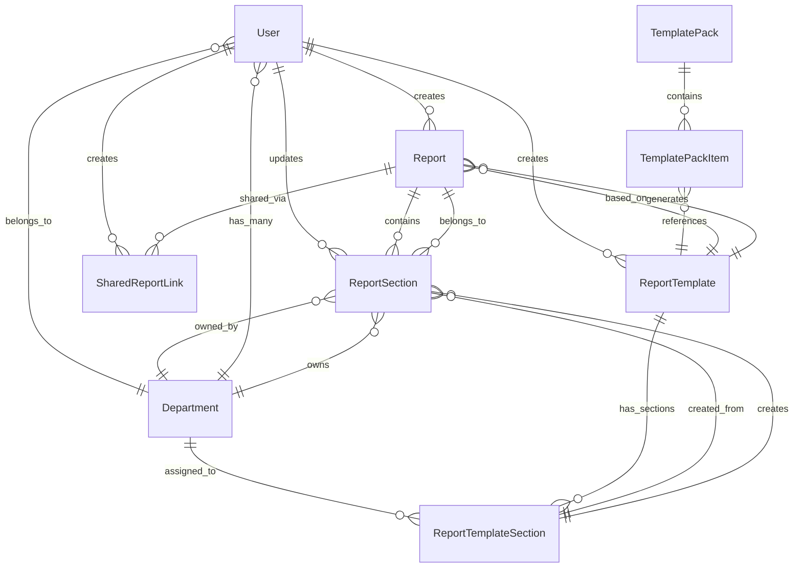

# Database Models Documentation (Prisma v0.3)

> **Source of Truth:** [`server/prisma/schema.prisma`](../server/prisma/schema.prisma)  
> **Generated:** 2025-07-11  
> **Schema Version:** v0.3 - Complete feature set with auto-save, external sharing, and template systems

This document serves as the definitive reference for the Report Fusion Hub database schema, including all models, relationships, constraints, and design patterns.

## Architecture Overview

The database is built on PostgreSQL with Prisma ORM, following a normalized relational design with the following core principles:

- **Template-Based Architecture**: Reports are created from reusable templates organized in template packs
- **Department-Centric Ownership**: All content is associated with specific departments for access control
- **State Machine Workflows**: Both reports and sections follow defined state transitions
- **External Sharing Capability**: Secure snapshot-based sharing with access controls
- **Cascade Delete Safety**: Proper foreign key relationships with appropriate cascade behaviors

## Entity Relationship Overview



## Model Definitions

### User
Authentication and authorization entity supporting role-based access control.

| Field | Type | Constraints | Description |
|-------|------|-------------|-------------|
| `id` | String | `@id @default(cuid())` | Unique identifier |
| `username` | String | `@unique` | Login username (case-insensitive) |
| `name` | String | Required | Display name for UI |
| `email` | String? | `@unique` | Optional email address |
| `password` | String | Required | bcrypt hashed password |
| `role` | UserRole | `@default(department)` | Access role (secretary/department) |
| `departmentId` | String? | FK → Department | Department association |
| `createdAt` | DateTime | `@default(now())` | Record creation timestamp |
| `updatedAt` | DateTime | `@updatedAt` | Auto-updated modification timestamp |

**Relationships:**
- `department`: Many-to-One with Department
- `reports`: One-to-Many with Report (as creator)
- `reportTemplates`: One-to-Many with ReportTemplate (as creator)
- `updatedSections`: One-to-Many with ReportSection (as updater)
- `sharedReportLinks`: One-to-Many with SharedReportLink (as creator)

**Business Rules:**
- Username is used for authentication (not email)
- Secretary role has system-wide admin privileges
- Department role is restricted to assigned department content

### Department
Organizational units that own content and control access.

| Field | Type | Constraints | Description |
|-------|------|-------------|-------------|
| `id` | String | `@id @default(cuid())` | Unique identifier |
| `name` | String | `@unique` | Department display name |
| `createdAt` | DateTime | `@default(now())` | Record creation timestamp |
| `updatedAt` | DateTime | `@updatedAt` | Auto-updated modification timestamp |

**Relationships:**
- `users`: One-to-Many with User
- `reportSections`: One-to-Many with ReportSection
- `templateSections`: One-to-Many with ReportTemplateSection

**Business Rules:**
- Department names must be unique across the system
- Departments control access to their assigned report sections
- Users can only belong to one department

### TemplatePack
Collections of report templates that define standard report structures.

| Field | Type | Constraints | Description |
|-------|------|-------------|-------------|
| `id` | String | `@id @default(cuid())` | Unique identifier |
| `name` | String | `@unique` | Pack display name |
| `description` | String? | Optional | Pack description |
| `createdAt` | DateTime | `@default(now())` | Record creation timestamp |
| `updatedAt` | DateTime | `@updatedAt` | Auto-updated modification timestamp |

**Relationships:**
- `items`: One-to-Many with TemplatePackItem

### TemplatePackItem
Junction table managing the relationship between template packs and report templates with ordering.

| Field | Type | Constraints | Description |
|-------|------|-------------|-------------|
| `id` | String | `@id @default(cuid())` | Unique identifier |
| `packId` | String | FK → TemplatePack | Template pack reference |
| `templateId` | String | FK → ReportTemplate | Report template reference |
| `displayOrder` | Int | Required | Order within the pack |

**Unique Constraints:**
- `@@unique([packId, templateId])` - Prevents duplicate templates in packs
- `@@unique([packId, displayOrder])` - Ensures unique ordering within packs

**Cascade Behavior:**
- `onDelete: Cascade` for both pack and template relationships

### ReportTemplate
Master templates that define the structure and sections of reports.

| Field | Type | Constraints | Description |
|-------|------|-------------|-------------|
| `id` | String | `@id @default(cuid())` | Unique identifier |
| `name` | String | Required | Template display name |
| `description` | String? | Optional | Template description |
| `createdById` | String | FK → User | Template creator |
| `isActive` | Boolean | `@default(true)` | Template availability status |
| `createdAt` | DateTime | `@default(now())` | Record creation timestamp |
| `updatedAt` | DateTime | `@updatedAt` | Auto-updated modification timestamp |

**Relationships:**
- `createdBy`: Many-to-One with User
- `sections`: One-to-Many with ReportTemplateSection
- `reports`: One-to-Many with Report
- `templatePackItems`: One-to-Many with TemplatePackItem

### ReportTemplateSection
Individual sections within report templates, defining department assignments and instructions.

| Field | Type | Constraints | Description |
|-------|------|-------------|-------------|
| `id` | String | `@id @default(cuid())` | Unique identifier |
| `templateId` | String | FK → ReportTemplate | Parent template |
| `sectionName` | String | Required | Section display name |
| `instructions` | String? | `@db.Text` | Department instructions |
| `departmentId` | String | FK → Department | Assigned department |
| `displayOrder` | Int | Required | Section order within template |

**Unique Constraints:**
- `@@unique([templateId, displayOrder])` - Ensures unique ordering within templates

**Relationships:**
- `template`: Many-to-One with ReportTemplate
- `department`: Many-to-One with Department
- `reportSections`: One-to-Many with ReportSection

**Cascade Behavior:**
- `onDelete: Cascade` for template relationship

### Report
Main content entities representing board reports with workflow state management.

| Field | Type | Constraints | Description |
|-------|------|-------------|-------------|
| `id` | String | `@id @default(cuid())` | Unique identifier |
| `title` | String | Required | Report title |
| `description` | String? | Optional | Report description |
| `cycle` | ReportCycle | Required | Report frequency type |
| `dueAt` | DateTime? | Optional | Report due date |
| `state` | ReportState | `@default(DRAFT)` | Workflow state |
| `finalizedAt` | DateTime? | Optional | Finalization timestamp |
| `isDeleted` | Boolean | `@default(false)` | Soft delete flag |
| `templateId` | String? | FK → ReportTemplate | Source template |
| `createdById` | String? | FK → User | Report creator |
| `createdAt` | DateTime | `@default(now())` | Record creation timestamp |
| `updatedAt` | DateTime | `@updatedAt` | Auto-updated modification timestamp |

**Relationships:**
- `template`: Many-to-One with ReportTemplate
- `createdBy`: Many-to-One with User
- `sections`: One-to-Many with ReportSection
- `sharedLinks`: One-to-Many with SharedReportLink

**State Machine:** `DRAFT → FINAL → PUBLISHED`

### ReportSection
Individual sections within reports with independent state management and department ownership.

| Field | Type | Constraints | Description |
|-------|------|-------------|-------------|
| `id` | String | `@id @default(cuid())` | Unique identifier |
| `reportId` | String | FK → Report | Parent report |
| `sectionName` | String | Required | Section display name |
| `instructions` | String? | `@db.Text` | Section-specific instructions |
| `departmentId` | String | FK → Department | Owning department |
| `state` | SectionState | `@default(DRAFT)` | Section workflow state |
| `dueAt` | DateTime? | Optional | Section due date |
| `displayOrder` | Int | `@default(0)` | Section order within report |
| `locked` | Boolean | `@default(false)` | Edit lock status |
| `isActive` | Boolean | `@default(true)` | Section availability |
| `contentMarkdown` | String? | `@db.Text` | Section content (Markdown) |
| `submittedAt` | DateTime? | Optional | Submission timestamp |
| `updatedById` | String? | FK → User | Last updater |
| `updatedAt` | DateTime | `@updatedAt` | Auto-updated modification timestamp |
| `reportTemplateSectionId` | String? | FK → ReportTemplateSection | Source template section |

**Unique Constraints:**
- `@@unique([reportId, displayOrder])` - Ensures unique ordering within reports

**Relationships:**
- `report`: Many-to-One with Report
- `department`: Many-to-One with Department
- `updatedBy`: Many-to-One with User
- `reportTemplateSection`: Many-to-One with ReportTemplateSection

**Cascade Behavior:**
- `onDelete: Cascade` for report relationship
- `onDelete: NoAction` for template section (preserves history)

**State Machine:** `DRAFT → SUBMITTED`

### SharedReportLink
External sharing mechanism with secure access control and snapshot preservation.

| Field | Type | Constraints | Description |
|-------|------|-------------|-------------|
| `id` | String | `@id @default(cuid())` | Unique identifier |
| `reportId` | String | FK → Report | Shared report |
| `snapshotJson` | Json | Required | Report content snapshot |
| `accessLevel` | SharedReportAccess | Required | Permission level |
| `codeHash` | String | Required | Secure access code |
| `expiresAt` | DateTime? | Optional | Link expiration |
| `createdById` | String | FK → User | Link creator |
| `createdAt` | DateTime | `@default(now())` | Record creation timestamp |
| `updatedAt` | DateTime | `@updatedAt` | Auto-updated modification timestamp |

**Relationships:**
- `report`: Many-to-One with Report
- `createdBy`: Many-to-One with User

**Indexes:**
- `@@index([reportId])` - Performance optimization for report queries

**Cascade Behavior:**
- `onDelete: Cascade` for report relationship

## Enums

### UserRole
```prisma
enum UserRole {
  secretary   // System administrator with full access
  department  // Department user with restricted access
}
```

### ReportCycle
```prisma
enum ReportCycle {
  WEEKLY    // Weekly reports
  MONTHLY   // Monthly reports  
  ADHOC     // Ad-hoc/irregular reports
}
```

### ReportState
```prisma
enum ReportState {
  DRAFT      // Initial state, editable
  FINAL      // Finalized, ready for publication
  PUBLISHED  // Published to stakeholders
}
```

### SectionState
```prisma
enum SectionState {
  DRAFT      // Section being worked on
  SUBMITTED  // Section completed and submitted
}
```

### SharedReportAccess
```prisma
enum SharedReportAccess {
  VIEW     // Read-only access to shared report
  COMMENT  // Read access with commenting capability
}
```

## Database Design Patterns

### 1. Template-Instance Pattern
The system uses a template-instance pattern where:
- `ReportTemplate` + `ReportTemplateSection` = Template Definition
- `Report` + `ReportSection` = Instance Implementation
- Templates are reusable blueprints, instances are actual working documents

### 2. Soft Delete Pattern
Reports use soft deletion via `isDeleted` flag rather than hard deletion to:
- Preserve audit trails and relationships
- Allow recovery of accidentally deleted reports
- Maintain referential integrity with related entities

### 3. State Machine Implementation
Both reports and sections implement state machines:
- **Report States**: `DRAFT → FINAL → PUBLISHED`
- **Section States**: `DRAFT → SUBMITTED`
- State transitions are controlled by business logic in the application layer

### 4. Department-Based Access Control
All content is associated with departments for fine-grained access control:
- Users belong to specific departments
- Report sections are assigned to departments
- Template sections specify target departments

### 5. Cascade Delete Strategy
Careful cascade behavior ensures data integrity:
- **Cascade**: Template packs → items, reports → sections
- **NoAction**: Template sections ← report sections (preserves history)
- **SetNull**: Optional foreign keys remain intact

## Index Strategy

### Performance Indexes
- `SharedReportLink.reportId` - Optimizes shared link lookups
- Unique constraints automatically create indexes for:
  - User username and email
  - Department name
  - TemplatePack name
  - Composite unique constraints

### Query Optimization Considerations
- Department-based queries are optimized via foreign key indexes
- Report section ordering uses compound indexes on `(reportId, displayOrder)`
- Template relationships benefit from foreign key indexes

## Common Query Patterns

### 1. Department Dashboard Query
```sql
-- Get all active sections for a department with report context
SELECT rs.*, r.title, r.dueAt as reportDueAt, r.state as reportState
FROM "ReportSection" rs
JOIN "Report" r ON rs."reportId" = r.id
WHERE rs."departmentId" = $1 
  AND rs."isActive" = true 
  AND r."isDeleted" = false
ORDER BY r."dueAt" ASC, rs."displayOrder" ASC;
```

### 2. Report Creation from Template
```sql
-- Create report sections from template sections
INSERT INTO "ReportSection" (
  id, "reportId", "sectionName", instructions, "departmentId", 
  "displayOrder", "reportTemplateSectionId"
)
SELECT 
  gen_random_uuid(), $1, rts."sectionName", rts.instructions, 
  rts."departmentId", rts."displayOrder", rts.id
FROM "ReportTemplateSection" rts
WHERE rts."templateId" = $2
ORDER BY rts."displayOrder";
```

### 3. Report Progress Tracking
```sql
-- Calculate report completion percentage
SELECT 
  r.id,
  r.title,
  COUNT(rs.id) as total_sections,
  COUNT(CASE WHEN rs.state = 'SUBMITTED' THEN 1 END) as completed_sections,
  ROUND(
    COUNT(CASE WHEN rs.state = 'SUBMITTED' THEN 1 END) * 100.0 / COUNT(rs.id), 
    2
  ) as completion_percentage
FROM "Report" r
LEFT JOIN "ReportSection" rs ON r.id = rs."reportId" AND rs."isActive" = true
WHERE r."isDeleted" = false
GROUP BY r.id, r.title;
```

## Migration Considerations

### Version History
- **v0.1**: Initial schema with basic report and user models
- **v0.2**: Added template system and department relationships
- **v0.3**: Implemented external sharing, enhanced template packs, optimized indexes

### Future Schema Changes
When modifying the schema:
1. Always create migrations: `npx prisma migrate dev`
2. Update seed data if needed: `npx prisma db seed`
3. Regenerate Prisma client: `npx prisma generate`
4. Update this documentation
5. Run tests to verify compatibility: `npm test`

### Data Migration Scripts
For complex data transformations, create custom migration scripts in `server/prisma/migrations/` that handle:
- Data type changes
- Relationship restructuring  
- Default value population
- Constraint additions

## Security Considerations

### Data Protection
- Passwords are bcrypt hashed before storage
- Shared report links use secure hash codes for access
- Foreign key constraints prevent orphaned records
- Role-based access control limits data exposure

### Audit Trail
- All entities include `createdAt` and `updatedAt` timestamps
- Report sections track `updatedBy` for change attribution
- Soft delete preserves historical data
- Snapshot preservation in shared reports maintains point-in-time views

This documentation should be updated whenever the Prisma schema changes to maintain accuracy as the source of truth for database operations.