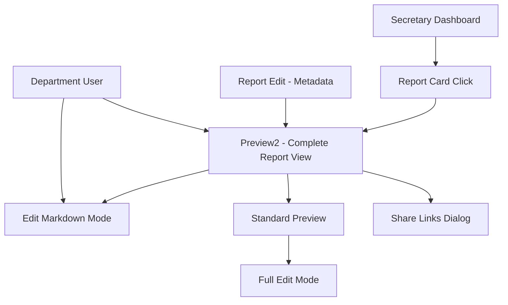

# Functional Specification – v0.3 (2025-07-11)

This document captures **what** the system must do from the user’s perspective. Architectural details live in `architecture.md`.

## Actors
| Role | Description |
|------|-------------|
| **Secretary** | Power user, manages templates, packs, reports, departments, users |
| **Department Contributor** | Fills in assigned report sections, views progress |
| **External Stakeholder** | Accesses shared reports via secure links with access codes |
| **System Administrator** | Manages system-wide settings and user accounts |

## Use-Case Diagram

```mermaid
flowchart TD
    secretary -- CRUD --> User[User Management]
    secretary -- CRUD --> Department
    secretary -- CRUD --> ReportTemplate
    secretary -- CRUD --> TemplatePack
    secretary -- Create --> Report[Report via Creation Page]
    secretary -- Create --> SharedLink[Shared Report Links]
    secretary -- Edit --> FullReport[Full Report Editor]
    contributor -- Edit/Submit --> ReportSection
    contributor -- Upload --> Images[Encrypted Images]
    contributor -- Receives --> OnboardingGuidance[Onboarding & Progress]
    secretary -- Transition --> ReportStates[DRAFT→FINAL→PUBLISHED]
    secretary -- Export --> DOCX
    external[External Stakeholder] -- Access --> SharedLink
    external -- Enter --> AccessCode[6-digit Access Code]
    system -- AutoSave --> Content[Report & Section Content]
    system -- Encrypt --> FileStorage[Secure File Storage]
    system -- Localize --> UI[Vietnamese/English UI]
    system -- StatusIndicators --> User
```

## Core Functional Requirements

### Authentication & User Management
| ID | Description |
|----|-------------|
| **FR-001** | Users authenticate via username + password → HTTP-only JWT cookies |
| **FR-002** | System supports role-based access control (secretary, department) |
| **FR-003** | Secretary can perform full CRUD operations on user accounts |
| **FR-004** | Secretary can create/edit/delete departments with automatic user linking |

### Template & Report Management
| ID | Description |
|----|-------------|
| **FR-005** | Secretary can manage `ReportTemplate` with multiple `ReportTemplateSection` |
| **FR-006** | Secretary can manage `TemplatePack` containing ordered `TemplatePackItem` |
| **FR-007** | Secretary can create `Report` via dedicated creation page (custom or from template/pack) |
| **FR-008** | System supports **five distinct viewing/editing modes** for comprehensive report management |
| **FR-009** | Reports follow state workflow: `DRAFT` → `FINAL` → `PUBLISHED` |
| **FR-010** | Report sections follow state workflow: `DRAFT` → `SUBMITTED` |

### Content Creation & Editing
| ID | Description |
|----|-------------|
| **FR-011** | Contributors can edit and **submit** own `ReportSection` with BlockNote rich text editor |
| **FR-012** | Secretary can edit full reports using integrated BlockNote editor with section markers |
| **FR-013** | System provides **auto-save** functionality for report content (30-45s intervals) |
| **FR-014** | System supports **encrypted image uploads** linked to specific reports |
| **FR-015** | All report content supports markdown with rich text formatting |

### Sharing & Export
| ID | Description |
|----|-------------|
| **FR-016** | Secretary can create **shared report links** with 6-digit access codes |
| **FR-017** | Shared links support different access levels (VIEW, COMMENT) with expiration |
| **FR-018** | External stakeholders can access reports via shared links without authentication |
| **FR-019** | Finalised reports can be exported to PDF format with encrypted image support |
| **FR-020** | System maintains **snapshot JSON** of reports for shared links |

### User Experience & Localization
| ID | Description |
|----|-------------|
| **FR-021** | Department users receive **onboarding guidance** and progress tracking |
| **FR-022** | System provides **visual status indicators** for saving states and section progress |
| **FR-023** | Full **bilingual support** (Vietnamese and English) with user preference storage |
| **FR-024** | Responsive design optimized for desktop, tablet, and mobile devices |

### Security & Data Protection
| ID | Description |
|----|-------------|
| **FR-025** | All uploaded files are **encrypted at rest** using AES-256-GCM |
| **FR-026** | File access requires authentication and proper authorization |
| **FR-027** | System implements secure file storage with directory isolation per report |
| **FR-028** | Shared links use cryptographically secure random codes |

## Data Model Summary

### Core Entities
- **User**: Authentication accounts with roles (secretary/department) and department linking
- **Department**: Organizational units with hierarchical user relationships
- **ReportTemplate**: Master templates with metadata and section definitions
- **ReportTemplateSection**: Individual sections within templates with department assignments
- **TemplatePack**: Curated collections of templates with ordered items
- **Report**: Report instances with workflow states and metadata
- **ReportSection**: Individual sections within reports with independent state management
- **SharedReportLink**: External sharing links with access codes and permissions

### Workflow States
- **Report States**: `DRAFT` → `FINAL` → `PUBLISHED`
- **Section States**: `DRAFT` → `SUBMITTED`
- **Access Levels**: `VIEW`, `COMMENT` for shared links
- **User Roles**: `secretary`, `department`
- **Report Cycles**: `WEEKLY`, `MONTHLY`, `ADHOC`

## Non-Functional Requirements
| Category | Target |
|----------|--------|
| Availability | ≥99.5% uptime |
| Performance | p95 <2s page load on 4G |
| Accessibility | WCAG 2.1 AA |
| Security | OWASP ASVS L2 + AES-256-GCM file encryption |
| Localization | Vietnamese (vi) & English (en) with runtime switching |
| Test Coverage | ≥70% unit coverage + comprehensive E2E test suite |
| File Security | Encrypted storage with access control and audit logging |
| Data Privacy | Department-isolated content with role-based access |

## Complete Feature Inventory (v0.3)

### Advanced Template System
- **ReportTemplate**: Master templates with metadata and multiple sections
- **ReportTemplateSection**: Individual sections within templates with department assignments
- **TemplatePack**: Curated collections of templates for specific report types
- **Template-to-Report Creation**: Automatic section generation from templates

### Dual Editing Modes
- **Section-by-Section**: Department users edit assigned sections independently
- **Full Document Editor**: Secretary users can edit entire reports with BlockNote rich text editor
- **Section Markers**: Automated insertion of section break markers in full editor
- **Content Synchronization**: Bidirectional sync between section and full document modes

### Advanced User & Department Management
- **User Administration**: Full CRUD operations for user accounts with role management
- **Department Administration**: Complete department lifecycle management
- **Automatic User Linking**: Department creation automatically creates linked user accounts
- **Role-Based Filtering**: Different views and permissions based on user roles

### Secure File Handling System
- **Encrypted Upload**: AES-256-GCM encryption for all uploaded images
- **Secure Storage**: Files stored in isolated directories per report
- **Access Control**: File access requires authentication and proper permissions
- **Report-Specific Images**: Images are linked to specific reports with access restrictions

### External Sharing & Collaboration
- **Shared Report Links**: Generate secure links for external stakeholder access
- **Access Codes**: 6-digit cryptographically secure codes for link access
- **Access Levels**: Configurable permissions (VIEW, COMMENT) for shared content
- **Link Expiration**: Optional expiration dates for shared links
- **Snapshot System**: JSON snapshots preserve report state at time of sharing

### Comprehensive Localization
- **Bilingual Interface**: Full Vietnamese and English language support
- **User Preferences**: Language selection persisted in localStorage
- **Dynamic Translation**: Runtime translation system with variable interpolation
- **Cultural Adaptation**: Date formats and UI conventions adapted per locale

### Recent Enhancements (Auto-Save & UX)

- **Dual intervals**: 45s for report metadata, 30s for section content
- **Smart change detection**: Only saves when content actually changes
- **Visual feedback**: Saving/saved status with timestamps
- **Error handling**: Graceful conflict resolution and retry logic
- **Department onboarding**: 4-step welcome guidance for new users
- **Progress tracking**: Visual indicators for section completion status
- **Dedicated report creation**: Full-page workflow replacing inline dialogs
- **Mobile responsiveness**: Optimized for all device sizes

### Comprehensive Testing Infrastructure
- **E2E Test Suite**: Playwright tests covering authentication, workflows, and business processes
- **Cookie-based Auth Testing**: Validation of HTTP-only cookie authentication flows
- **Auto-save Validation**: Testing of save functionality, timing, and error scenarios
- **Cross-browser Compatibility**: Tests ensure functionality across different browsers
- **Mobile Testing**: Responsive design validation on various device sizes

## Technical Architecture Highlights

### Frontend Architecture
- **React 18** with TypeScript and Vite build system
- **Tailwind CSS** with shadcn/ui component library
- **React Query** for server state management and caching
- **React Router** for client-side routing with protected routes
- **BlockNote** rich text editor with markdown support
- **Responsive Design** with mobile-first approach

### Backend Architecture
- **Node.js 20+** with Express.js framework
- **Prisma ORM** with PostgreSQL database
- **JWT Authentication** using HTTP-only cookies
- **Multer** for file upload handling with memory storage
- **AES-256-GCM** encryption for file storage security
- **Role-based middleware** for route protection

### Security Implementation
- **HTTP-only cookies** prevent XSS token theft
- **File encryption** using cryptographically secure keys
- **Access code generation** using crypto.randomBytes
- **Directory isolation** for uploaded files per report
- **Input validation** and sanitization on all endpoints
- **Rate limiting** and security headers implementation

## Recent Feature Implementations (July 2025)

### ✅ **Vertical Navigation System**
**Implementation**: Complete sidebar navigation with admin control and database persistence
- **Global Settings Model**: Database-backed configuration system
- **Admin Control Interface**: `/admin/navigation-settings` for real-time navigation type switching
- **Responsive Design**: Mobile sheet overlay with keyboard shortcuts (⌘B/Ctrl+B)
- **Accessibility**: WCAG 2.1 AA compliance with proper ARIA labels and screen reader support

### ✅ **Comprehensive Internationalization**
**Implementation**: Full Vietnamese/English support with runtime switching
- **1000+ Translation Keys**: Complete interface coverage including business terminology
- **Context-Aware Translations**: Variable substitution and pluralization support
- **Language Persistence**: User preference stored in localStorage
- **Real-time Switching**: No page refresh required for language changes

### ✅ **Enhanced DocumentPreview System**
**Implementation**: Professional PDF viewer-style interface
- **Multiple View Modes**: Continuous, pages, sections, compact display options
- **Navigation Panel**: Table of contents with jump-to-section functionality
- **Progress Tracking**: Real-time reading progress indicator
- **Keyboard Navigation**: Arrow keys and page navigation support
- **Print Optimization**: Professional typography and document styling

### ✅ **Enhanced Accessibility Features**
**Implementation**: WCAG 2.1 AA compliance across all components
- **Skip Links**: Keyboard navigation shortcuts for efficient browsing
- **Focus Management**: Proper focus indicators and keyboard trap handling
- **Screen Reader Support**: Comprehensive ARIA labels and announcements
- **High Contrast**: Enhanced visual accessibility for users with visual impairments

## Open Questions / Future Extensibility
1. **Export formats**: ✅ PDF export completed (2025-07-18), PowerPoint export capabilities planned
2. **Notification system**: Email/Slack notifications for workflow transitions
3. **Advanced RBAC**: Policy-based permissions beyond secretary/department roles
4. **Template versioning**: Version control for template changes
5. **Report archiving**: Long-term storage and retrieval of historical reports
6. **Audit logging**: Comprehensive activity tracking and compliance reporting
7. **Real-time collaboration**: WebSocket-based live editing and comments
8. **Advanced analytics**: Usage metrics and report performance dashboards

> Status: v0.3 complete with comprehensive feature set including auto-save, UX improvements, secure file handling, external sharing, full localization, vertical navigation, and enhanced accessibility. Next focus: notification system and advanced export formats.

## Report Viewing & Editing Modes - Detailed UX Specifications

### Secretary Report Management Flow
When a secretary logs in, they see the dashboard with dual-tab interface (Reports/Templates). The default behavior when opening a report is:

1. **Dashboard** → **Report Cards** → **Click Report** → **Report Management Hub** (New Unified Interface) ✅ **IMPLEMENTED**

### Report Viewing/Editing Modes Evolution

#### **Current State: Five Modes** ✅ **PARTIALLY IMPLEMENTED**

**New Report Management Hub** (`/reports/{id}`) ✅ **COMPLETED 2025-06-24**:
- **Tab-based Interface**: Overview, Sections, Settings tabs
- **Unified Preview Dropdown**: Standard Preview, Enhanced Preview, Full Editor
- **Clean Action Toolbar**: Export, Share, Back navigation
- **Auto-save Integration**: Visual feedback for report details and sections

#### **Legacy Preview Modes** 🚧 **FUTURE DEVELOPMENT - CONSOLIDATION PLANNED**

#### **Mode 1: ReportPreview (`/reports/{id}/preview`)** 🔄 **FUTURE: TO BE UNIFIED**
**Purpose**: Standard read-only preview with limited editing access  
**User Access**: Secretary, Department (view-only)  
**Route**: `/reports/{id}/preview`  
**Component**: `FullReportPreview.tsx` → **FUTURE**: `ReportPreviewUnified.tsx`

**Current UX Specifications**:
- **Header**: Report title, cycle, creation date, state badge
- **Content Display**: Complete report with all active sections in sequential order
- **Export Function**: DOCX export button (secretary only)
- **Edit Access**: "Edit" button → navigates to `/reports/{id}/edit-full`
- **Section Interaction**: Click section → opens `SectionEditDialog` popup for editing
- **Visual Design**: Card-based layout with professional report formatting
- **Auto-Save**: None (read-only with popup editing)

**Future UX Specifications** 🔄 **PLANNED**:
- **Unified Component**: Merge with Preview2 into single `ReportPreviewUnified`
- **Mode Selector**: Toggle between `read-only`, `interactive`, `full-edit` modes
- **Consistent Styling**: Based on ShareSnapshot clean design
- **Role-based Interface**: Dynamic features based on user permissions

**Testing Scenarios**:
- Verify complete report content display
- Test DOCX export functionality
- Validate section dialog editing
- Check role-based button visibility

#### **Mode 2: ReportPreview2 (`/reports/{id}/preview2`) - PRIMARY SECRETARY VIEW** 🔄 **FUTURE: TO BE UNIFIED**
**Purpose**: Enhanced preview with inline editing capabilities  
**User Access**: Secretary (primary), Department  
**Route**: `/reports/{id}/preview2`  
**Component**: `FullReportPreview2.tsx` → **FUTURE**: `ReportPreviewUnified.tsx`

**Current UX Specifications**:
- **Header**: Report title with " - Preview 2" suffix, cycle, dates, state badge
- **Content Display**: Complete report content with all active sections
- **Inline Editing**: Click any section → direct markdown editing within the section
- **Edit Controls**: Save/Cancel buttons appear per section when editing
- **Auto-Save**: Visual feedback with saving/saved states and timestamps
- **Export Function**: DOCX export button available
- **Navigation**: "Edit Markdown" button → `/reports/{id}/edit-markdown`
- **Visual Design**: Seamless inline editing with real-time content updates

**Future UX Specifications** 🔄 **PLANNED**:
- **Unified Component**: Single preview component with mode switching
- **Seamless Mode Transitions**: Switch between read-only and interactive without navigation
- **Enhanced Visual Design**: Consistent with ShareSnapshot styling
- **Live Preview Updates**: Real-time content synchronization

**Testing Scenarios**:
- Verify complete report display as secretary's default view
- Test inline section editing workflow
- Validate auto-save functionality and visual feedback
- Test section-by-section save/cancel operations
- Verify markdown content preservation

#### **Mode 3: ReportEdit (`/reports/{id}`)**
**Purpose**: Report metadata management and section organization  
**User Access**: Secretary (full access), Department (redirected to Preview2)  
**Route**: `/reports/{id}`  
**Component**: `ReportEdit.tsx`

**UX Specifications**:
- **Secretary Features**:
  - Report details editing (title, description, cycle with Select dropdown)
  - Section activation toggles (checkbox controls to enable/disable sections)
  - Share links dialog for external stakeholder access
  - Auto-save for report details (45-second intervals)
  - Visual status indicators for save states
- **Department Redirect**: Automatically redirected to Preview2 for content editing
- **Tabs Interface**: Separate tabs for report details vs. content management
- **Section Management**: List view of all sections with active/inactive controls

**Testing Scenarios**:
- Test secretary report metadata editing
- Verify department user redirection to Preview2
- Test section activation/deactivation controls
- Validate 45-second auto-save intervals
- Test share links dialog functionality

#### **Mode 4: ReportEdit with Markdown (`/reports/{id}/edit-markdown`)**
**Purpose**: Department users' section-specific editing interface  
**User Access**: Department (primary), Secretary  
**Route**: `/reports/{id}/edit-markdown`  
**Component**: `ReportEdit.tsx` (same component, different route)

**UX Specifications**:
- **Content Focus**: Section-specific editing with BlockNote rich text editor
- **Auto-Save**: 30-second intervals for section content
- **Section Selection**: Department users see only their assigned sections
- **Rich Text Features**: Full BlockNote editor capabilities (formatting, images, etc.)
- **Progress Tracking**: Visual indicators for section completion status
- **Save States**: Real-time feedback for saving/saved/error states

**Testing Scenarios**:
- Test department user section assignment filtering
- Verify 30-second auto-save functionality
- Test BlockNote editor features and image uploads
- Validate section progress tracking
- Test role-based section visibility

#### **Mode 5: ReportFullEditPage (`/reports/{id}/edit-full`)**
**Purpose**: Secretary's full document editor with BlockNote  
**User Access**: Secretary only (access control enforced)  
**Route**: `/reports/{id}/edit-full`  
**Component**: `ReportFullEditPage.tsx`

**UX Specifications**:
- **Access Control**: Strict secretary-only access with error redirect
- **Full Document Editing**: Complete report as single BlockNote document
- **Section Markers**: Automatic section break markers (`<!-- SECTION_BREAK_MARKER -->`)
- **Content Consolidation**: All sections combined into unified editing experience
- **Advanced Features**: Full BlockNote schema with rich text capabilities
- **Save Workflow**: Manual save with validation and error handling
- **Section Preservation**: Maintains section boundaries through markers

**Testing Scenarios**:
- Verify secretary-only access control
- Test full document editing workflow
- Validate section marker preservation
- Test content consolidation and separation
- Verify BlockNote editor integration

### Navigation Flow Between Modes

### Role-Based Access Matrix

| Mode | Secretary Access | Department Access | External Access |
|------|-----------------|-------------------|------------------|
| ReportPreview | Full (edit + export) | Read-only | Via shared links only |
| ReportPreview2 | Full (primary view) | Limited editing | No |
| ReportEdit | Full metadata control | Redirected to Preview2 | No |
| Edit Markdown | Full access | Section-specific only | No |
| Full Edit | Full document editing | Access denied | No |

## Key User Journeys for Testing

### Secretary User Journey - Updated for Five-Mode System
1. **Dashboard Access**: Login → Dual-tab interface (Reports/Templates)
2. **Report Management**: View all reports in card layout with status indicators
3. **Primary Report View**: Click report → **Preview2 mode** (complete report content)
4. **Content Review**: Use Preview2 for immediate content overview and inline editing
5. **Metadata Management**: Use ReportEdit mode for title, description, cycle, section toggles
6. **Advanced Editing**: Use Full Edit mode for comprehensive BlockNote document editing  
7. **External Sharing**: Generate secure shared links with access codes from any viewing mode
8. **Export & Distribution**: Export to DOCX from Preview or Preview2 modes
9. **Workflow Management**: Transition reports through DRAFT → FINAL → PUBLISHED states

### Department User Journey
1. **Onboarding**: Complete 4-step welcome process with progress guidance
2. **Dashboard Access**: View assigned report sections and completion status
3. **Section Editing**: Edit assigned sections using BlockNote rich text editor
4. **Image Upload**: Add encrypted images to section content
5. **Auto-save Experience**: Content automatically saved with visual feedback
6. **Section Submission**: Submit completed sections for secretary review
7. **Progress Tracking**: Monitor overall report completion status

### External Stakeholder Journey
1. **Link Access**: Receive shared report link from secretary
2. **Code Entry**: Enter 6-digit access code to view report
3. **Report Viewing**: Access read-only report content based on permissions
4. **Content Navigation**: Browse through report sections and content

### System Administration Journey
1. **User Management**: CRUD operations on user accounts with role assignments
2. **Department Management**: Create/modify departments and user associations
3. **Template Administration**: Manage report templates and template packs
4. **Security Monitoring**: Oversee file encryption and access controls

## Critical Test Scenarios - Enhanced for Five-Mode System

### Report Viewing & Editing Mode Testing
**Mode Accessibility**:
- Secretary access to all five modes with proper navigation
- Department user access restrictions and automatic redirects
- External user access via shared links only to Preview mode

**Mode-Specific Functionality**:
- Preview2 as primary secretary entry point with complete report display
- Inline editing workflow in Preview2 with save/cancel operations
- Full Edit mode section marker preservation and content consolidation
- ReportEdit metadata management with 45-second auto-save
- Edit Markdown mode department-specific section filtering

**Navigation Flow Testing**:
- Dashboard → Report Card → Preview2 flow validation
- Mode-to-mode navigation button functionality
- Back navigation and browser history handling
- Role-based navigation restrictions

### Authentication & Authorization
- Login/logout flows with HTTP-only cookies
- Role-based access control validation per mode
- Session persistence and expiration handling
- Unauthorized access attempt handling and redirects
- Secretary-only Full Edit mode access enforcement

### Auto-Save Functionality by Mode
**Preview2 Mode**:
- Inline section editing auto-save with visual feedback
- Save state indicators (saving/saved/error)
- Content change detection for individual sections

**ReportEdit Mode**:
- Report metadata auto-save (45-second intervals)
- Title, description, cycle changes detection
- Section toggle state preservation

**Edit Markdown Mode**:
- Section content auto-save (30-second intervals)
- BlockNote editor content synchronization
- Department user section filtering validation

### File Security
- Image upload encryption validation across all editing modes
- File access authorization checks per mode
- Secure file serving with decryption
- Directory isolation verification

### External Sharing
- Shared link generation from Preview and Preview2 modes
- Access code validation and expiration
- Different permission level enforcement
- Report snapshot consistency across modes

### Localization
- Language switching functionality across all modes
- UI translation completeness for mode-specific interfaces
- Date/time format localization consistency
- User preference persistence across sessions

### Workflow State Management
- Report state transitions (DRAFT→FINAL→PUBLISHED) across modes
- Section state transitions (DRAFT→SUBMITTED) in editing modes
- State-based permission enforcement per mode
- Workflow validation and business rules consistency

### Content Integrity Testing
**Cross-Mode Content Synchronization**:
- Content changes in Preview2 reflected in other modes
- Section edits in Edit Markdown mode synchronized with Preview2
- Full Edit mode section marker preservation
- Content consistency after mode transitions

**Data Persistence**:
- Auto-save functionality across mode switches
- Content preservation during network interruptions
- Conflict resolution with concurrent editing
- Section activation/deactivation state consistency