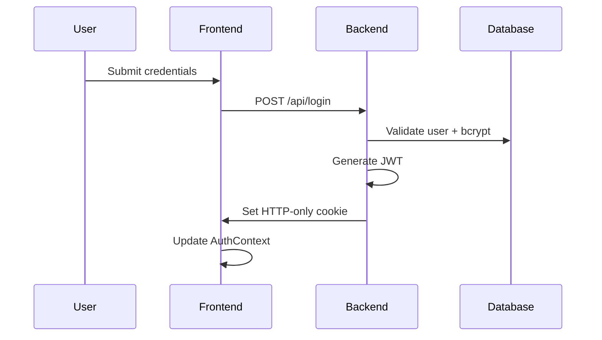
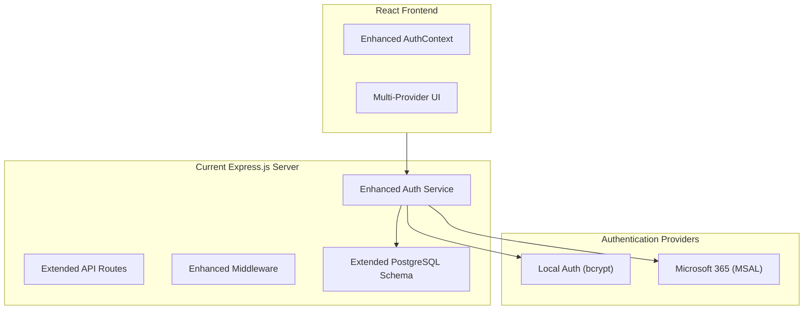
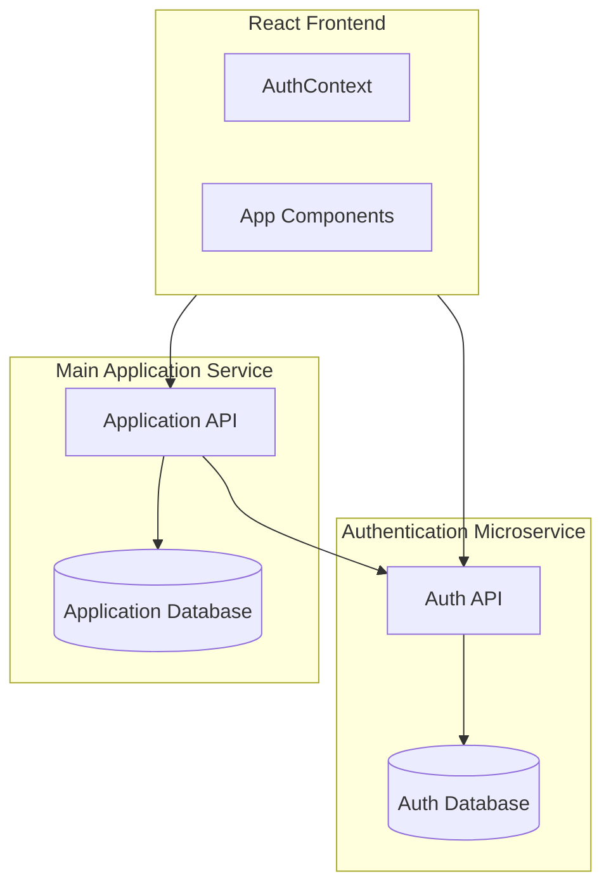

# Microsoft 365 Integration - Technical Decision Log
_Version: 1.0 | Created: 2025-07-10 | Author: Engineering Team | Branch: feature/microsoft-365-integration_

## 📋 Executive Summary

> **DECISION**: Extend current Express.js backend with hybrid authentication supporting both local and Microsoft 365 users in a unified architecture.

**Key Architectural Decision:**
- ✅ **Enhanced Monolith** with multi-provider authentication
- ✅ **Same Database** with schema extension for Microsoft 365 fields
- ✅ **Unified User Model** supporting multiple authentication providers
- ✅ **Backward Compatibility** preserving existing local authentication

**Business Impact phấn 
- **Implementation Time**: 12 weeks vs 20+ weeks for microservice approach
- **Operational Complexity**: Single deployment unit vs distributed system
- **User Experience**: Seamless authentication with provider choice
- **Security Compliance**: 2025 MFA mandate ready with Conditional Access support

---

## 🏗️ Current State Analysis

### **Existing Architecture Assessment**

**Current Technology Stack:**
```json
{
  "backend": {
    "framework": "Express.js",
    "database": "PostgreSQL",
    "orm": "Prisma",
    "authentication": "JWT + HTTP-only cookies",
    "authorization": "Role-based (secretary/department)"
  },
  "frontend": {
    "framework": "React 18 + TypeScript",
    "authentication": "AuthContext + React hooks",
    "api_layer": "React Query for state management"
  },
  "security": {
    "file_encryption": "AES-256-GCM",
    "password_hashing": "bcrypt",
    "session_management": "JWT with HTTP-only cookies"
  }
}
```

**Current Authentication Flow:**


**Strengths of Current Architecture:**
- ✅ **Clean modular structure** with clear separation of concerns
- ✅ **Robust security model** with encrypted files and secure sessions
- ✅ **Scalable database design** with proper relationships
- ✅ **Well-tested authentication** with comprehensive E2E coverage
- ✅ **Role-based authorization** with department isolation

**Current Limitations for Enterprise:**
- ❌ **Single authentication provider** (local only)
- ❌ **Manual user management** without automated provisioning
- ❌ **No MFA enforcement** capability
- ❌ **No integration with corporate identity** systems

---

## 🎯 Requirements Analysis

### **Business Requirements**

**Primary Objectives:**
1. **Enterprise SSO**: Microsoft 365 authentication for organizational users
2. **Role Mapping**: Automatic user provisioning with department assignment
3. **Security Compliance**: MFA enforcement and Conditional Access support
4. **Hybrid Support**: Maintain existing local authentication for non-M365 users
5. **Zero Disruption**: No impact on existing users during migration

**Compliance Requirements:**
- **2025 MFA Mandate**: Microsoft enforcing MFA for all admin centers (Feb 2025)
- **Conditional Access**: Support Azure AD security policies
- **Audit Logging**: Complete authentication event tracking
- **Data Protection**: Maintain existing encryption and privacy standards

### **Technical Requirements**

**Authentication Requirements:**
```typescript
interface AuthenticationRequirements {
  providers: ['local', 'microsoft365'];
  mfa_support: boolean;           // true
  conditional_access: boolean;    // true
  auto_provisioning: boolean;     // true
  role_mapping: boolean;         // true
  backward_compatibility: boolean; // true
  session_management: 'unified';
  token_format: 'jwt_enhanced';
}
```

**Performance Requirements:**
- **OAuth Flow**: Complete authentication in <30 seconds
- **User Provisioning**: New user setup in <5 minutes
- **API Response Time**: <200ms for authentication endpoints
- **Availability**: 99.9% uptime for authentication services

**Security Requirements:**
- **Token Security**: Enhanced JWT with provider information
- **Secret Management**: Azure Key Vault for production credentials
- **Network Security**: HTTPS-only with proper CORS configuration
- **Audit Logging**: All authentication events with comprehensive metadata

---

## ⚖️ Architecture Options Evaluated

### **Option 1: Enhanced Monolith (SELECTED)**

**Architecture Overview:**


**Implementation Strategy:**
- **Extend existing User model** with Microsoft 365 fields
- **Enhance authentication middleware** for multi-provider support
- **Add new API endpoints** for Microsoft 365 OAuth flow
- **Integrate MSAL libraries** for server and client-side OAuth
- **Maintain backward compatibility** for all existing features

**Pros:**
- ✅ **Fastest implementation** (12 weeks vs 20+ weeks)
- ✅ **Single deployment unit** simplifies operations
- ✅ **Unified data model** eliminates synchronization complexity
- ✅ **Leverages existing infrastructure** (CORS, middleware, error handling)
- ✅ **Backward compatible** with zero disruption to existing users
- ✅ **Unified authorization** with consistent role-based access control

**Cons:**
- ⚠️ **Larger codebase** in single service (manageable with good structure)
- ⚠️ **Single point of failure** for authentication (mitigated by good monitoring)

### **Option 2: Separate Authentication Microservice (REJECTED)**

**Architecture Overview:**


**Implementation Strategy:**
- **Create separate Express.js service** for authentication only
- **Deploy separate PostgreSQL database** for user management
- **Implement service-to-service communication** for authorization
- **Handle distributed data consistency** across services

**Pros:**
- ✅ **Separation of concerns** at service level
- ✅ **Independent scaling** of authentication service
- ✅ **Technology flexibility** for future authentication features

**Cons:**
- ❌ **20+ week implementation** due to distributed complexity
- ❌ **Data synchronization** challenges between services
- ❌ **Network latency** for every authenticated request
- ❌ **Distributed transaction** complexity for user operations
- ❌ **Deployment complexity** with multiple services to coordinate
- ❌ **Testing complexity** requiring integration test environments
- ❌ **Operational overhead** monitoring and debugging distributed system

### **Decision Matrix**

| Criteria | Weight | Enhanced Monolith | Separate Microservice |
|----------|--------|-------------------|----------------------|
| **Implementation Speed** | 25% | 9/10 (12 weeks) | 4/10 (20+ weeks) |
| **Operational Complexity** | 20% | 9/10 (Single service) | 3/10 (Distributed) |
| **Development Complexity** | 20% | 8/10 (Familiar patterns) | 4/10 (New patterns) |
| **Performance** | 15% | 9/10 (No network calls) | 6/10 (Service calls) |
| **Backward Compatibility** | 10% | 10/10 (Zero changes) | 7/10 (API changes) |
| **Future Scalability** | 10% | 7/10 (Good enough) | 9/10 (Excellent) |

**Weighted Score:**
- **Enhanced Monolith**: 8.5/10
- **Separate Microservice**: 4.7/10

---

## 🎯 Selected Solution: Enhanced Monolith

### **Technical Architecture**

**Enhanced Authentication Service:**
```typescript
class AuthenticationService {
  // Existing local authentication (preserved)
  async authenticateLocal(username: string, password: string): Promise<User> {
    // Existing bcrypt validation logic
  }
  
  // NEW: Microsoft 365 authentication
  async authenticateMicrosoft365(authCode: string): Promise<User> {
    // MSAL token exchange
    // User provisioning from Azure AD
    // Role mapping from groups
  }
  
  // Unified session management
  async createSession(user: User, provider: AuthProvider): Promise<SessionData> {
    // Enhanced JWT with provider information
    // MFA enforcement logic
    // Conditional Access validation
  }
}
```

**Enhanced Database Schema:**
```prisma
model User {
  id                    String        @id @default(cuid())
  
  // Core identity (enhanced)
  username              String?       @unique  // Optional for M365 users
  email                 String        @unique  // Primary identifier
  name                  String
  password              String?       // Optional for M365-only users
  
  // Authentication provider support
  authProvider          AuthProvider  @default(LOCAL)
  authMethod            AuthMethod    @default(PASSWORD)
  
  // Microsoft 365 integration
  azureAdUserId         String?       @unique
  azureAdTenantId       String?
  microsoftEmail        String?
  lastMicrosoftSync     DateTime?
  
  // Enhanced security
  isActive              Boolean       @default(true)
  requiresMFA           Boolean       @default(false)
  lastLoginAt           DateTime?
  
  // Existing relationships (preserved)
  role                  UserRole      @default(department)
  department            Department?   @relation(fields: [departmentId], references: [id])
  reports               Report[]      @relation("ReportCreator")
  // ... all existing relations maintained
}

enum AuthProvider {
  LOCAL
  MICROSOFT_365
  AZURE_AD
}

enum AuthMethod {
  PASSWORD
  OAUTH
  SSO
}
```

**Enhanced API Endpoints:**
```typescript
// Existing endpoints (enhanced)
POST   /api/auth/login              // Enhanced for provider detection
GET    /api/auth/me                 // Enhanced with provider info
POST   /api/auth/logout             // Universal logout

// NEW: Microsoft 365 endpoints
POST   /api/auth/microsoft/login    // Initiate OAuth flow
GET    /api/auth/microsoft/callback // Handle OAuth callback
POST   /api/auth/refresh            // Token refresh
GET    /api/auth/providers          // Available providers

// NEW: Admin endpoints
GET    /api/admin/auth/config       // Authentication configuration
POST   /api/admin/auth/config       // Update auth settings
POST   /api/admin/users/provision   // Bulk user provisioning
POST   /api/admin/azure/sync        // Manual Azure AD sync
```

### **Implementation Phases**

**Phase 1: Foundation (Weeks 1-3)**
- Database schema migration with M365 fields
- Azure AD application registration and Key Vault setup
- Install MSAL dependencies and configure environment

**Phase 2: Backend Enhancement (Weeks 4-6)**
- Implement AuthenticationService with Microsoft 365 support
- Enhance authentication middleware for multi-provider
- Create new API endpoints for Microsoft 365 OAuth

**Phase 3: Frontend Integration (Weeks 7-8)**
- Enhance AuthContext with Microsoft 365 support
- Implement MSAL React integration
- Create multi-provider authentication UI

**Phase 4: Testing & Quality (Weeks 9-10)**
- Comprehensive testing across authentication providers
- Security testing and penetration testing
- Performance testing and optimization

**Phase 5: Deployment (Weeks 11-12)**
- Staged deployment with pilot user groups
- Data migration and Azure AD synchronization
- Production deployment with monitoring

---

## 🔒 Security Implementation

### **Enhanced JWT Token Structure**
```typescript
interface EnhancedJWTPayload {
  userId: string;
  role: UserRole;
  authProvider: AuthProvider;
  authMethod: AuthMethod;
  azureTenantId?: string;
  mfaCompleted?: boolean;
  lastPasswordChange?: string;
  sessionId: string;
  iat: number;
  exp: number;
}
```

### **MFA Enforcement Strategy**
```typescript
class MFAEnforcer {
  async validateMFARequirement(user: User, context: AuthContext): Promise<MFAResult> {
    // Check organization MFA policy
    // Validate Azure AD Conditional Access
    // Enforce role-based MFA requirements
    // Handle MFA bypass for service accounts
  }
  
  async handleConditionalAccess(azureToken: string): Promise<ConditionalAccessResult> {
    // Validate Azure AD Conditional Access policies
    // Handle device compliance requirements
    // Manage location-based access controls
  }
}
```

### **Audit Logging Enhancement**
```typescript
interface AuthenticationAuditLog {
  eventId: string;
  timestamp: DateTime;
  userId?: string;
  email?: string;
  eventType: 'LOGIN_ATTEMPT' | 'LOGIN_SUCCESS' | 'LOGIN_FAILURE' | 'LOGOUT' | 'TOKEN_REFRESH' | 'MFA_CHALLENGE';
  authProvider: AuthProvider;
  authMethod: AuthMethod;
  sourceIP: string;
  userAgent: string;
  sessionId?: string;
  azureTenantId?: string;
  errorCode?: string;
  errorMessage?: string;
  securityContext?: {
    mfaRequired: boolean;
    conditionalAccessPolicies: string[];
    deviceCompliance: boolean;
    locationTrusted: boolean;
  };
}
```

---

## ⚠️ Risk Assessment & Mitigation

### **Technical Risks**

**Risk 1: Authentication Provider Downtime**
- **Impact**: High - Users cannot authenticate with affected provider
- **Probability**: Low - Microsoft 365 has 99.9% SLA
- **Mitigation**: 
  - Maintain hybrid authentication (local + M365)
  - Implement graceful degradation to local auth
  - Cache authentication decisions for short periods
  - Comprehensive monitoring and alerting

**Risk 2: Database Schema Migration Issues**
- **Impact**: High - Potential data loss or corruption
- **Probability**: Medium - Complex schema changes
- **Mitigation**:
  - Comprehensive backup strategy before migration
  - Staged migration with rollback procedures
  - Extensive testing in staging environment
  - Database migration validation scripts

**Risk 3: JWT Token Complexity**
- **Impact**: Medium - Authentication failures or security issues
- **Probability**: Low - Well-established patterns
- **Mitigation**:
  - Thorough testing of token generation and validation
  - Backward compatibility for existing tokens during transition
  - Clear token versioning strategy
  - Comprehensive error handling and logging

**Risk 4: Microsoft 365 Integration Complexity**
- **Impact**: Medium - Delayed implementation or security vulnerabilities
- **Probability**: Medium - External service integration
- **Mitigation**:
  - Use Microsoft's official MSAL libraries
  - Follow Microsoft's security best practices
  - Implement comprehensive error handling
  - Regular security reviews and penetration testing

### **Business Risks**

**Risk 1: User Adoption Resistance**
- **Impact**: Medium - Reduced productivity during transition
- **Probability**: Medium - Change management challenges
- **Mitigation**:
  - Maintain existing authentication methods
  - Gradual rollout with pilot groups
  - Comprehensive user training and documentation
  - Clear communication about benefits

**Risk 2: Compliance Violations**
- **Impact**: High - Regulatory fines or security breaches
- **Probability**: Low - Strong security implementation
- **Mitigation**:
  - Regular security audits and compliance reviews
  - Implementation of all required security controls
  - Comprehensive audit logging and monitoring
  - Regular penetration testing

---

## 📊 Success Metrics & KPIs

### **Technical Performance Metrics**

```typescript
interface AuthenticationMetrics {
  // Performance KPIs
  authenticationSuccessRate: number;        // Target: >99.5%
  averageOAuthFlowTime: number;            // Target: <30 seconds
  averageUserProvisioningTime: number;     // Target: <5 minutes
  apiResponseTime: number;                 // Target: <200ms
  
  // Security KPIs
  mfaComplianceRate: number;               // Target: 100%
  conditionalAccessCompliance: number;     // Target: 100%
  securityIncidentCount: number;           // Target: 0
  failedLoginAttempts: number;             // Monitor for threats
  
  // Business KPIs
  microsoftAuthAdoptionRate: number;       // Target: 80% within 3 months
  userSatisfactionScore: number;           // Target: >4.5/5
  supportTicketReduction: number;          // Target: 50% reduction in auth issues
  administrativeEfficiency: number;        // Target: 70% reduction in user provisioning time
}
```

### **Monitoring Implementation**

**Real-time Dashboards:**
- Authentication success/failure rates by provider
- OAuth flow performance metrics
- MFA compliance tracking
- Security event monitoring
- User adoption analytics

**Alerting Strategy:**
- Authentication failure rate >1%
- OAuth flow timeout >30 seconds
- MFA policy violations
- Suspicious authentication patterns
- Service downtime or degradation

---

## 🔮 Future Considerations

### **Scalability Path**

**Phase 1**: Enhanced Monolith (Current Decision)
- Single Express.js service with multi-provider auth
- Unified PostgreSQL database
- Suitable for current scale (hundreds to thousands of users)

**Phase 2**: Service Extraction (Future, if needed)
- Extract authentication to dedicated microservice
- Implement when scale demands (>10K users, multiple applications)
- Preserve API contracts for seamless transition

**Phase 3**: Enterprise Identity Platform (Long-term)
- Multi-application authentication service
- Advanced identity governance features
- Integration with additional identity providers

### **Technology Evolution**

**Authentication Standards:**
- **FIDO2/WebAuthn**: Passwordless authentication support
- **OpenID Connect**: Additional enterprise identity providers
- **SCIM**: Automated user lifecycle management
- **Zero Trust**: Enhanced security posture with continuous verification

**Infrastructure Evolution:**
- **Container Orchestration**: Kubernetes deployment for scale
- **Service Mesh**: Advanced networking and security
- **Observability**: Enhanced monitoring and tracing
- **Edge Authentication**: CDN-based authentication for global scale

---

## 📚 Dependencies & Requirements

### **Technical Dependencies**

**Backend Dependencies:**
```json
{
  "new_dependencies": {
    "@azure/msal-node": "^2.6.6",
    "@azure/keyvault-secrets": "^4.8.0",
    "passport-azure-ad": "^4.3.5"
  },
  "enhanced_dependencies": {
    "jsonwebtoken": "^9.0.1",
    "express": "^4.18.2",
    "@prisma/client": "^6.8.2"
  }
}
```

**Frontend Dependencies:**
```json
{
  "new_dependencies": {
    "@azure/msal-browser": "^3.10.0",
    "@azure/msal-react": "^2.0.13"
  },
  "enhanced_dependencies": {
    "react": "^18.2.0",
    "@tanstack/react-query": "^5.0.0"
  }
}
```

### **Infrastructure Requirements**

**Azure Services:**
- **Azure AD Application**: OAuth application registration
- **Azure Key Vault**: Secure credential storage
- **Azure AD Premium**: Conditional Access features (if required)

**Environment Configuration:**
```bash
# New environment variables required
AZURE_CLIENT_ID=your_application_client_id
AZURE_CLIENT_SECRET=your_application_client_secret
AZURE_TENANT_ID=your_azure_tenant_id
AZURE_REDIRECT_URI=https://yourdomain.com/auth/microsoft/callback
AZURE_KEY_VAULT_URL=https://yourkeyvault.vault.azure.net/

# Feature flags
ENABLE_MICROSOFT_365_AUTH=true
ENFORCE_SSO=false
REQUIRE_MFA=false
DEFAULT_AUTH_PROVIDER=local
```

### **Development Environment Setup**

**Prerequisites:**
- Node.js 18+ for MSAL library compatibility
- Azure Developer Account for app registration
- PostgreSQL 13+ for enhanced schema features
- SSL certificates for OAuth redirect URIs

**Development Tools:**
- Azure CLI for Key Vault access
- Prisma Studio for database management
- MSAL browser dev tools for OAuth debugging
- Postman for API testing with OAuth flows

---

## 📖 Documentation Requirements

### **Technical Documentation Updates**

**API Documentation:**
- Enhanced OpenAPI specification with Microsoft 365 endpoints
- Authentication flow diagrams for both providers
- Error code documentation for OAuth failures
- Rate limiting and security policy documentation

**Database Documentation:**
- Updated schema documentation with new fields
- Migration guide for existing installations
- Data retention and cleanup policies
- Backup and recovery procedures for enhanced schema

**Security Documentation:**
- OAuth 2.0 implementation details
- MFA enforcement policies and procedures
- Conditional Access configuration guide
- Security incident response procedures

### **User Documentation**

**Administrator Guide:**
- Azure AD application setup instructions
- User provisioning and role mapping configuration
- Monitoring and troubleshooting guide
- Security policy configuration

**End User Guide:**
- Microsoft 365 login instructions
- MFA setup and troubleshooting
- Account linking procedures for existing users
- Privacy and data handling information

---

## ✅ Conclusion

The decision to implement Microsoft 365 integration through an **Enhanced Monolith** approach represents the optimal balance of implementation speed, operational simplicity, and enterprise security requirements.

**Key Success Factors:**
1. **Backward Compatibility**: Zero disruption to existing users
2. **Security First**: MFA and Conditional Access from day one
3. **Operational Simplicity**: Single deployment and monitoring surface
4. **Enterprise Ready**: Automated provisioning and role mapping
5. **Future Proof**: Architecture supports evolution to microservices if needed

**Next Steps:**
1. **Stakeholder Approval**: Review and approve this technical decision
2. **Team Assignment**: Assign development team and project timeline
3. **Infrastructure Setup**: Begin Azure AD registration and Key Vault configuration
4. **Implementation Start**: Commence Phase 1 development work

This architectural decision positions the Report Fusion platform for enterprise adoption while maintaining the reliability and simplicity that has made the current system successful.

---

*This technical decision log serves as the definitive reference for the Microsoft 365 integration project and will be updated as implementation progresses and new technical insights are gained.*

**Document History:**
- v1.0 (2025-07-10): Initial technical analysis and architectural decision
- Next Update: Post Phase 1 implementation review